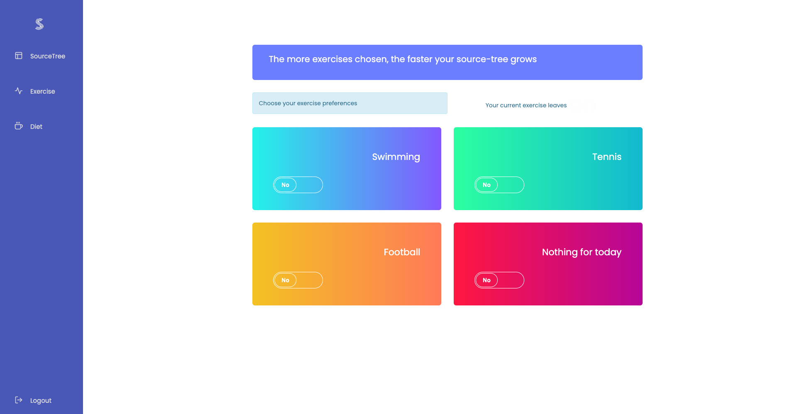
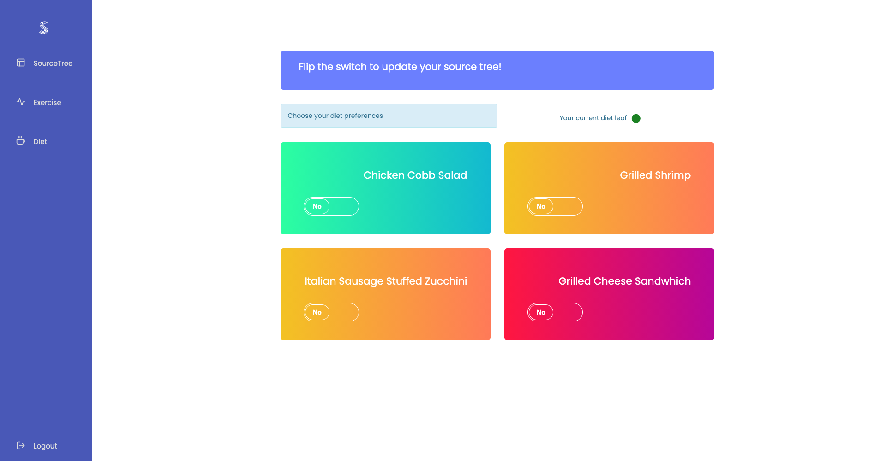

# SourceFit
Health Tracker

Practice Software Engineering project to build a Health tracker for demoing

1. Clone the repository
2. Open the project file location on your terminal
3. Run "python manage.py runserver"

